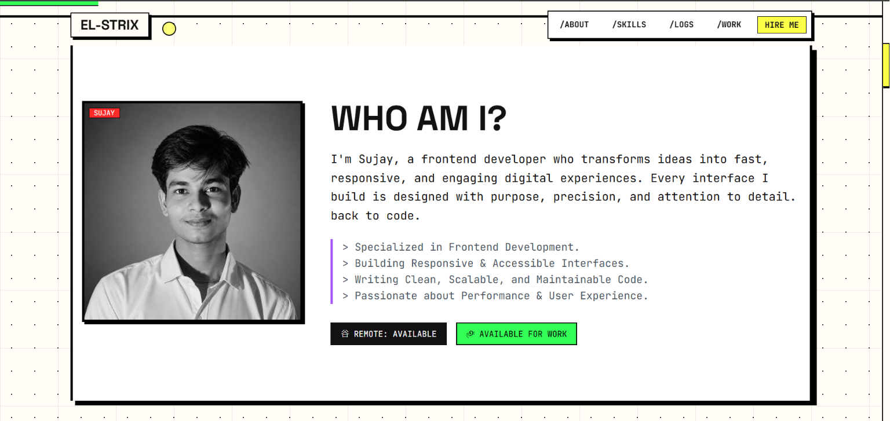

<p align="center">
  
</p>

<h1 align="center">Sujay Paul — Developer Portfolio</h1>

<p align="center">
  A brutalist-inspired developer portfolio built from scratch with HTML, Tailwind CSS, and vanilla JavaScript. No frameworks. No build step. Just clean, fast, hand-written code.
</p>

<p align="center">
  <a href="https://portfolio-v1-0-zeta-seven.vercel.app/">
    
  </a>
  
  
</p>

---

## Overview

This is my personal portfolio — a single-page website that presents my work, skills, and experience as a frontend developer. It deliberately avoids component libraries and build tooling in favor of hand-written HTML, custom CSS animations, and vanilla JavaScript.

The design draws from brutalist and neo-brutalist aesthetics: bold typography, hard box shadows, high-contrast color palettes, and raw geometric shapes. Every animation, every interaction, and every layout decision was written by hand.

**Live at:** [portfolio-v1-0-zeta-seven.vercel.app](https://portfolio-v1-0-zeta-seven.vercel.app/)

---

## Why This Project Exists

Most developer portfolios are templates. I wanted mine to demonstrate the thing it's selling — frontend engineering ability. Rather than dropping content into a pre-built theme, I built every piece from scratch: a custom animated preloader, a cursor that reacts to interactive elements, scroll-triggered reveals using `IntersectionObserver`, and an interactive terminal that responds to typed commands.

It's also a living project. As I take on new work and build new things, this portfolio grows with me.

---

## Key Features

### Visual Design
- **Neo-brutalist aesthetic** with hard shadows, bold borders, and a curated color system (yellow, pink, green, blue, purple, orange, red)
- **Two custom typefaces** — Space Grotesk for display text, JetBrains Mono for code and terminal elements
- **Responsive layout** that adapts to desktop, tablet, and mobile viewports
- **Custom scrollbar** styled to match the brutalist theme

### Animations & Interactions
- **Animated preloader** with orbital rings, progress bar, percentage counter, and terminal boot messages
- **Custom cursor** (desktop only) — a yellow dot that expands when hovering over interactive elements
- **Scroll progress bar** — a green bar at the top of the viewport that tracks page scroll position
- **Scroll-triggered reveals** — sections animate in as they enter the viewport, powered by `IntersectionObserver`
- **Glitch hover effect** — project titles shake with a CSS glitch animation on hover

### Interactive Terminal
A fully functional terminal embedded in the page. Type commands, browse history with arrow keys, and run `help` to see the full command list.

Built-in commands: `whoami`, `about`, `skills`, `experience`, `education`, `github`, `resume`, `contact`, `focus`, `philosophy`, `status`, `cls`

### Content Sections
- **Hero** — Name, title, availability status, and CTAs (view work / download resume)
- **About** — Profile photo (grayscale → color on hover), bio, and availability badges
- **Tech Stack** — Grid of 16 skills with category labels and individual hover colors
- **Experience Log** — Timeline layout with role descriptions and accomplishments
- **Projects** — Card grid with screenshots, descriptions, tech tags, and GitHub links
- **Contact** — Split layout with contact info and a message form
- **Footer** — Sitemap, social links, copyright

### SEO & Analytics
- Open Graph meta tags for link previews
- JSON-LD structured data (`Person` schema)
- Canonical URL
- Google Tag Manager integration
- Semantic HTML5 elements throughout
- Lazy image loading with timeout fallback

---

## Technology Stack

| Layer | Technology | Purpose |
|-------|-----------|---------|
| Markup | HTML5 | Semantic page structure |
| Utility CSS | Tailwind CSS v3 (CDN) | Layout, spacing, typography, responsive design |
| Custom CSS | Vanilla CSS | Animations, preloader, terminal, cursor, scrollbar |
| JavaScript | Vanilla JS (ES6+) | DOM interactions, IntersectionObserver, terminal engine |
| Icons | Remix Icon 3.5.0 | UI iconography |
| Fonts | Google Fonts | JetBrains Mono, Space Grotesk |
| Analytics | Google Tag Manager | Usage tracking |
| Hosting | Vercel | Static site deployment |
| Version Control | Git + GitHub | Source management |

---

## Project Structure

```
Portfolio-V1.0/
│
├── index.html                  # Single-page application — all markup lives here
│
├── Assets/
│   ├── app.css                 # Custom styles (preloader, terminal, animations)
│   ├── app.js                  # All JavaScript (cursor, scroll, preloader, terminal)
│   ├── images/
│   │   ├── main.png            # Profile photo
│   │   ├── C-games-collections.png  # Project: C Games Collection
│   │   ├── github-banner.png        # Project: GitHub Banner Engine
│   │   └── portfolio.png            # Project: Portfolio V1
│   └── Resume/
│       └── Resume.pdf          # Downloadable resume
│
├── README.md
└── LICENSE                     # MIT
```

---

## Getting Started

### Prerequisites

- A modern web browser (Chrome, Firefox, Safari, Edge)
- (Optional) A local HTTP server for development — `Live Server` VS Code extension works well

### Installation

```bash
git clone https://github.com/EL-STRIX/Portfolio-V1.0.git
cd Portfolio-V1.0
```

### Running Locally

**Option 1 — Direct open:**
Open `index.html` in your browser. Everything will work since dependencies are CDN-loaded.

**Option 2 — Local server (recommended for development):**

Using Python:
```bash
python -m http.server 8000
# Visit http://localhost:8000
```

Using Node.js:
```bash
npx serve .
# Visit the URL printed in terminal
```

Using VS Code:
Right-click `index.html` → "Open with Live Server"

### Configuration

No environment variables or configuration files are required. The site is fully self-contained.

To update your GTM container ID, edit line 32 in `index.html`:
```js
"GTM-TLNG322R"  // Replace with your GTM ID
```

---

## Development

Since there's no build step, development is straightforward: edit the files, refresh the browser.

| Task | How |
|------|-----|
| Edit markup | Modify `index.html` |
| Edit styles | Modify `Assets/app.css` for custom styles; use Tailwind classes in HTML for utility styles |
| Edit behavior | Modify `Assets/app.js` |
| Tailwind config | Edit the inline `tailwind.config` object in `index.html` (lines 77-104) |
| Add a project | Copy an existing `<article>` block in the projects section and update content |
| Add a terminal command | Add an entry to the `STACK_COMMANDS` object in `app.js` |

---

## Screenshots

<p align="center">
  
  <br />
  <em>Hero section with animated preloader and geometric elements</em>
</p>

---

## License

This project is licensed under the [MIT License](LICENSE).

---

## Author

**Sujay Paul**

- GitHub: [@EL-STRIX](https://github.com/EL-STRIX)
- LinkedIn: [Sujay Paul](https://www.linkedin.com/in/sujay-paul-684537374/)
- Email: [sujaypaul892@gmail.com](mailto:sujaypaul892@gmail.com)
- Portfolio: [portfolio-v1-0-zeta-seven.vercel.app](https://portfolio-v1-0-zeta-seven.vercel.app/)

---

<p align="center">
  <sub>Built from scratch. No templates. No shortcuts.</sub>
</p>